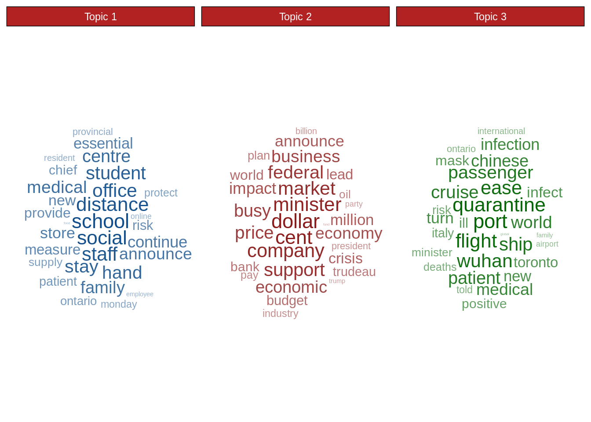

# Topic Modelling with Latent Dirichlet Allocation (LDA)

Introduction and application of Topic Modelling. Include use case for extracting topics from COVID-19 news and use topic model as a mean of dimensionality reduction in text classification.

